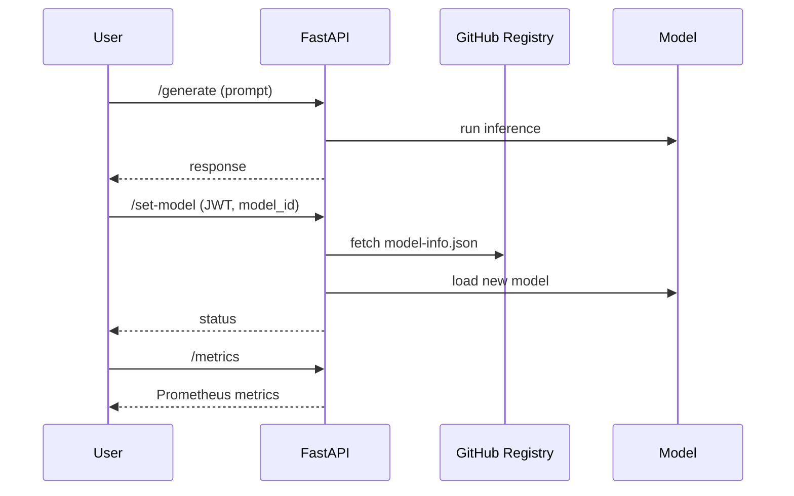

# Dynamic LLM Model Serving with FastAPI 🚀

This example demonstrates a production-grade FastAPI app that dynamically loads and switches LLM models using a GitHub-hosted registry pointer.

## Features

- Loads model from registry (`model-info.json` on GitHub)
- `/generate` endpoint for inference
- `/set-model` endpoint to switch model (secured in production)
- `/model-info` exposes current model metadata

## How It Works

1. On startup, app fetches `model-info.json` from GitHub and loads the specified model.
2. To switch models, update `model-info.json` via GitHub UI or API and call `/set-model`.
3. Inference requests use the current loaded model.

## Example Registry Pointer

```json
{
  "model_id": "mistralai/Mistral-7B-Instruct-v0.2",
  "source": "huggingface",
  "version": "v1.0.0"
}
```

## Security

- Model switching is protected using JWT.
- Set your `JWT_SECRET` as an env var.

## Observability

- `/metrics` endpoint exposes Prometheus metrics:
    - Inference latency
    - Model switch count
- `/healthz` endpoint for health checks.

## Architecture Diagram




## Credits

Designed as part of the AI Infra Architect curriculum.
